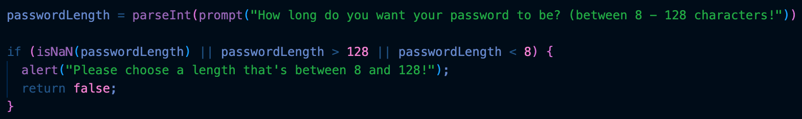
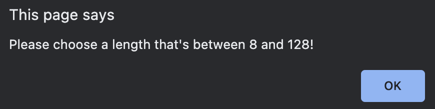
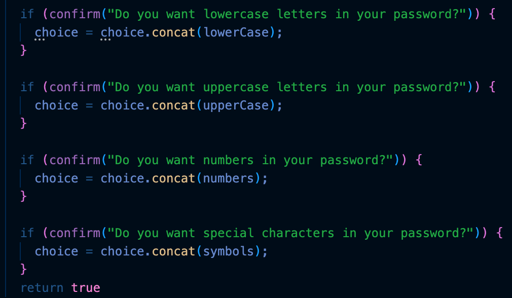

# Password Generator Starter Code

## Description
For this project, I was required to create a functional application that an employee can use to generate a random password with regards to the criteria they selected. Although the interface is polished and styled I was ultimately tasked with writing up the JavaScript that will power up the webpage. In terms of funtionality, this webpage should be able to throw 5 prompts at the user.

- how long does the user want their password to be.
- does the user want uppercase letters included.
- does the user want lowercase letters included.
- does the user want numbers included.
- does the user want special charaters included.

Honestly, this was a very difficult challenge. I dont think I've developed a full understanding of the console or how it works but I know that I had to tackle this challenge with a more calculated approach.

# Getting Started

## WHEN I click the button to generate a password, THEN I am presented with a series of prompts for password criteria.

This was the overall function of this webpage. to make this happen, I applied the equation below.

## WHEN prompted for password criteria, THEN I select which criteria to include in the password.
## WHEN prompted for the length of the password, THEN I choose a length of at least 8 characters and no more than 128 characters.

for this prompt to do what it does, I used an "if (isNaN(...) function along with adding straight (or brackets to ensure that the user chooses a number that corresponds with the prompt. If the user were to ask for a number outside the character list, the prompt would remind the user to stay within the bounderies of numbers between 8 and 128 before moving on to the next prompt.

## WHEN asked for character types to include in the password, THEN I confirm whether or not to include lowercase, uppercase, numeric, and/or special characters.
## WHEN I answer each prompt, THEN my input should be validated and at least one character type should be selected.

I had the criteria show up using a loop equation that holds the user's prompt choices. The script then records the user's choices and completes the task when all of the prompts are answered to generate a combination of letters, numbers, and special characters of the user's choice.

## WHEN all prompts are answered, THEN a password is generated that matches the selected criteria.
## WHEN the password is generated, THEN the password is either displayed in an alert or written to the page.

